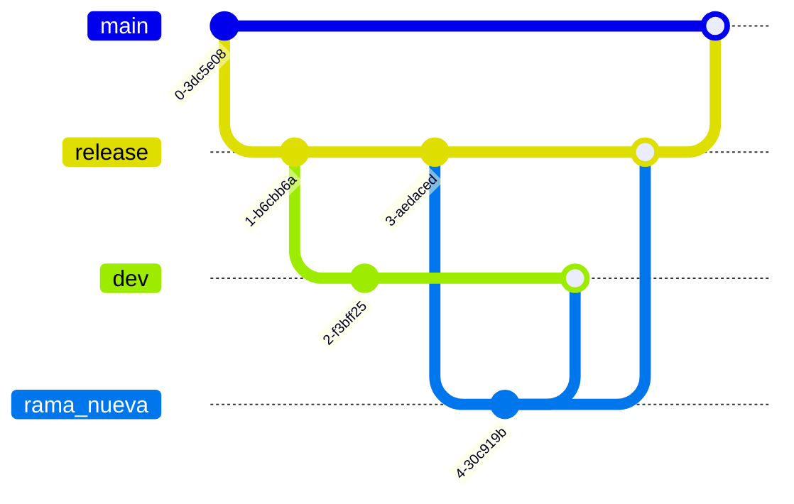
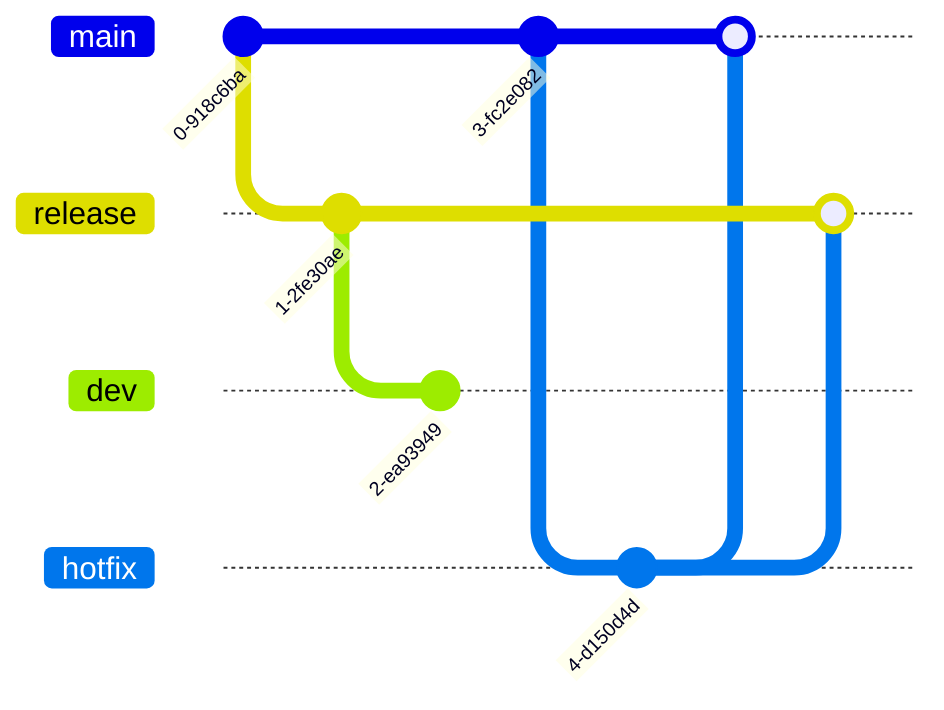

# Broobe Metrics

## Indice
* <a href="#project">Sobre el proyecto</a>
* <a href="#technology">Tecnologías</a>
* <a href="#setup">Instalación</a>
* <a href="#config">Configuración</a>
* <a href="#branchs">Cómo utilizar las ramas</a>

## Sobre el proyecto <a name="project"></a>
> Broobe metrics es una aplicacion web para analizar y ayudar a mejorar el rendimiento de los sitios web. Realizado para el challenge de Broobe

## Tecnologías <a name="technology"></a>

PHP 8.1.9
Node version v20.11.0

[![Laravel 10.43.0][Laravel.com]][Laravel-url] [![Bootstrap 5][Bootstrap.com]][Bootstrap-url] [![JQuery][JQuery.com]][JQuery-url]

## Instalación <a name="setup"></a>
1. Clonar su repositorio en local.
```bash
git clone git@github.com:gcadelago/broobe-metrics.git
```

2. Instalar la aplicación con composer (Si no tiene [Composer](https://getcomposer.org/ "https://getcomposer.org/")).
```bash
composer install
```

3. Instalar dependencias de node (Si no tiene [Nodejs](https://nodejs.org/en/))
```bash
npm install
```

## Configuración <a name="config"></a>
1. Crear la base de datos.

2. Cambiar el `.env.example` por `.env` y configurar la base de datos

3. Correr las migraciones con semillas para la configuración base del proyecto
```bash
php artisan migrate --seed
```

4. Publicar el archivo de configuración del paquete L5-Swagger:
```bash
php artisan vendor:publish --provider "L5Swagger\L5SwaggerServiceProvider"
```

5. Ahora puede usar el servidor web de su máquina para ver la página de inicio predeterminada con:
```bash
php artisan serve
```

Luego visite `{URL_BASE}/api-docs` para ver la página de documentación de la api.

6. Para cambiar el idioma vaya al archivo `.env` y modifique la linea:
```bash
APP_LOCALE=es
```

## Cómo utilizar las ramas <a name="branchs"></a>
La organización de las ramas consiste en:
- dev
- release
- main

Este es el flujo normal de las ramas:


Para realizar un hotfix:


<!-- Para los tags -->
<!-- https://www.markdownguide.org/basic-syntax/#reference-style-links -->
[Laravel.com]: https://img.shields.io/badge/Laravel-FF2D20?style=for-the-badge&logo=laravel&logoColor=white
[Laravel-url]: https://laravel.com
[Bootstrap.com]: https://img.shields.io/badge/Bootstrap-563D7C?style=for-the-badge&logo=bootstrap&logoColor=white
[Bootstrap-url]: https://getbootstrap.com
[JQuery.com]: https://img.shields.io/badge/jQuery-0769AD?style=for-the-badge&logo=jquery&logoColor=white
[JQuery-url]: https://jquery.com 
